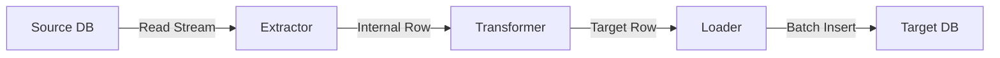

# Database Migration Strategy: Truncate IDE

This document outlines the technical strategy for implementing robust database migrations within Truncate IDE. The goal is to support seamless data and schema transfer between different database engines (e.g., MySQL → PostgreSQL, SQLite → MySQL) with high reliability and minimal downtime.

## 1. Core Architecture

The migration engine will operate on a **Pipeline Architecture** consisting of three distinct stages:

1.  **Extraction (Source)**: Reads schema and data from the source database.
2.  **Transformation (Intermediate)**: Normalizes types and data formats into an engine-agnostic intermediate representation (IR).
3.  **Load (Target)**: Translates the IR into target-specific SQL and writes to the destination database.

## 2. Schema Migration

Schema migration is the most critical phase. We must ensure that data types, constraints, and indexes are correctly translated to preserve data integrity.

### 2.1 Type Mapping Matrix

We will maintain a rigorous mapping table for all supported engines.

| Generic Type | MySQL       | PostgreSQL | SQLite    |
| :---         | :---        | :---       | :---      |
| **String**   | `VARCHAR`   | `TEXT`     | `TEXT`    |
| **Integer**  | `INT`       | `INTEGER`  | `INTEGER` |
| **BigInt**   | `BIGINT`    | `BIGINT`   | `INTEGER` |
| **Boolean**  | `TINYINT(1)`| `BOOLEAN`  | `INTEGER` (0/1) |
| **DateTime** | `DATETIME`  | `TIMESTAMP`| `TEXT` (ISO8601) |
| **JSON**     | `JSON`      | `JSONB`    | `TEXT`    |

### 2.2 Constraint Handling

1.  **Primary Keys**: Always preserved.
2.  **Foreign Keys**:
    *   *Step 1*: Disable FK checks on the target before migration.
    *   *Step 2*: Migrate all tables.
    *   *Step 3*: Re-enable FK checks. If the target engine supports "Deferred Constraints" (e.g., Postgres), we will utilize that.
3.  **Indexes**: Non-primary indexes will be created *after* data load to improve insertion performance.

## 3. Data Migration Pipeline

To handle large datasets without memory exhaustion, we will use a **Streaming Pipeline**.

### 3.1 Streaming & Batching
- **Cursor-Based Fetching**: We cannot load `SELECT * FROM table` into memory. We will use server-side cursors to fetch rows in chunks (e.g., 1000 rows/chunk).
- **Buffered Channel**: A bounded channel (size ~10k rows) will buffer data between the Reader and Writer threads to smooth out I/O latency.
- **Batch Inserts**: The Loader will group rows into batches (e.g., 500 rows) for bulk insertion (`INSERT INTO ... VALUES (...), (...);`).

### 3.2 Error Handling & Resilience
- **Row-Level Error Logging**: If a specific row fails (e.g., data overflow), it will be logged to a "Rejection File" (JSONL format) rather than aborting the entire migration.
- **Checkpoints**: For massive tables, we will implement checkpointing based on Primary Key ranges. If the migration crashes, it can resume from the last successful ID.

## 4. Verification & Validation

Migration is not complete until verified.

1.  **Row Count Validation**: Fast and simple check (`COUNT(*)` on both sides).
2.  **Checksum Hashing**:
    *   For critical tables, calculate a standard checksum (e.g., `MD5` or `CRC32`) of the data on both sides.
    *   *Note*: This requires normalizing data types (e.g., dates) to a common string format before hashing.
3.  **Sampling**: Randomly sample 100 rows from the source and verify their exact existence in the target.
